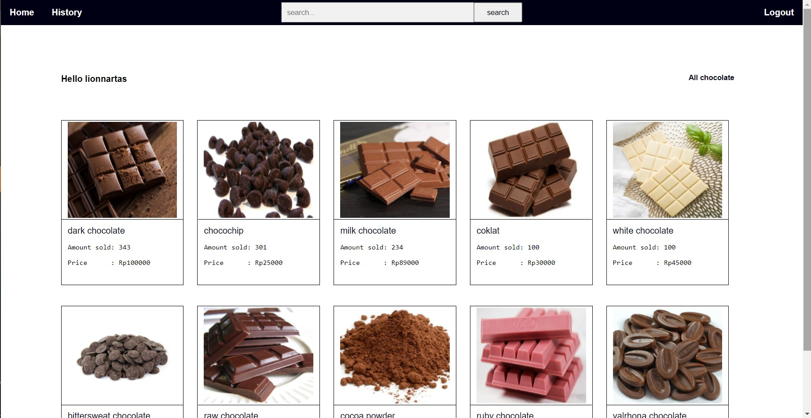
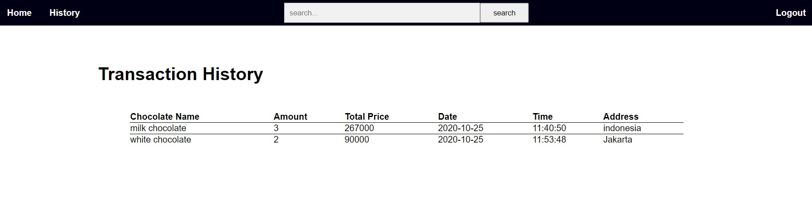
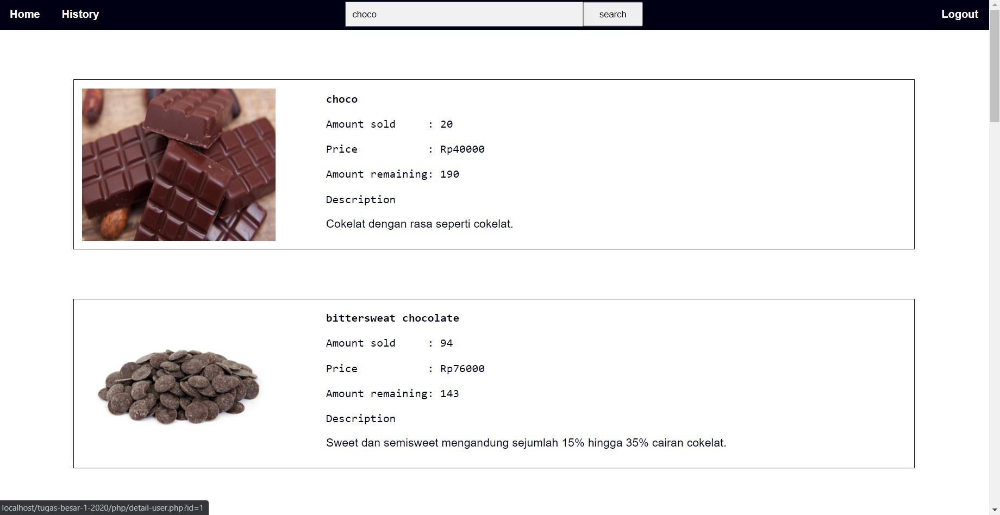
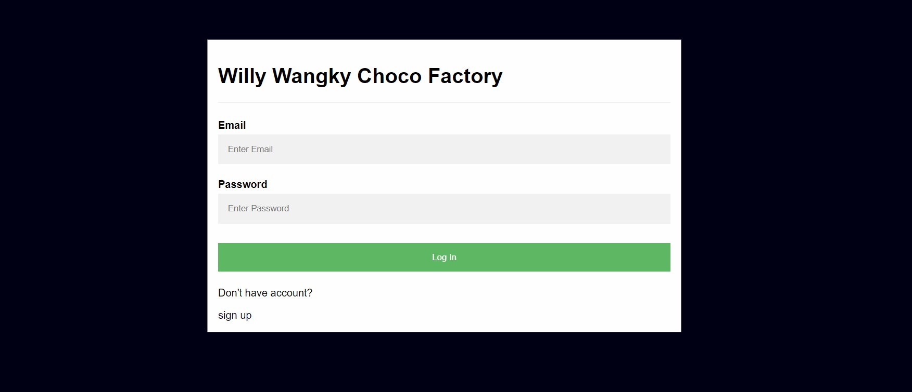
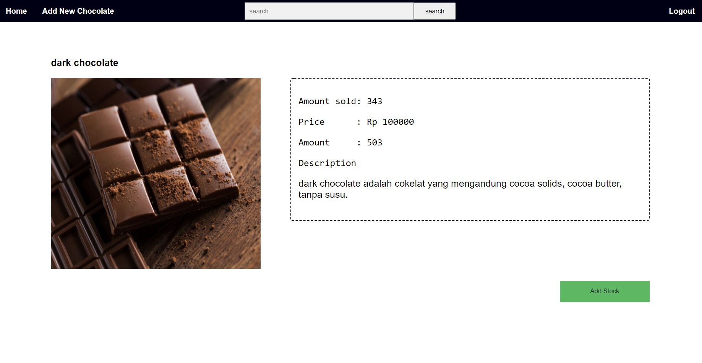

# Tugas Besar 2 IF3110 Pengembangan Aplikasi Berbasis Web 2020

* Thoriq Akbar Mahmudi                    13518106
* Muhammad Mirza Fathan Al Arsyad         13518111
* Arya Beri Argya Rasidi                  13518131

## Deskripsi Aplikasi Web
Aplikasi Web Willy Wangky membantu pengguna umum dan admin dalam melakukan transaksi pembelian coklat.
### Register
Aplikasi ini, memiliki fitur register bagi pengguna baru yang ingin daftar sebagai `user`. Bagi pengguna yang ingin mendaftar sebagai `superuser`, penambahan hanya dapat dilakukan melalui database secara manual. Setelah berhasil mendaftar, pengguna akan diarahkan ke laman dashboard.
### Login
Baik pengguna `user` maupun `superuser`, dapat melakukan login dengan memasukkan email dan password pengguna. Jika pengguna berhasil login, pengguna akan diarahkan langsung ke dashboard.
### Navigation Bar
Setiap laman selain Login dan Register memiliki Navigation Bar. Pada `user`, navigation bar memiliki home yang akan mengembalikan pengguna ke laman dashboard, kemudian tombol history akan mengarahkan pengguna ke laman history transaksi pengguna. Tombol logout akan mengeluarkan pengguna kembali ke laman login. Terdapat search bar untuk melakukan pencarian cokelat dan mengarahkan pengguna ke laman search. Pada `superuser`, navigation bar memiliki fitur yang sama kacuali tombol history yang diganti dengan Add New Chocolate yang mengarahkan pengguna ke laman add cokelat.
### Dashboard
Pada dashboard, akan ditampilkan 10 daftar cokelat dengan jumlah penjualan terbanyak. Pengguna dapat melihat detail cokelat dengan menekan gambar atau nama cokelat. Setelah itu pengguna akan diarahkan ke laman Detail Cokelat.
### Detail Cokelat
Pada laman ini menampilkan spesifikasi detail cokelat yang ingin dibeli oleh `user` atau ditambahkan oleh `suuperuser`.
### History
Pada laman ini, `user` akan diberikan tabel berisi history transaksi dari `user` tersebut.
### Search Page
Pada laman pengguna diberikan data tentang hasil pencarian berdasarkan nama dari cokelat.
### Add Chocolate
Pada laman ini, pengguna `superuser` dapat menambahkan varian cokelat baru ke dalam database.

## Daftar Requirement
1. XAMPP untuk menjalankan Apache dan MySQL.
2. MySQL sebagai database penyimpanan transaksi.

## Cara Instalasi
1. Memasukkan database 'willy_wangky.sql' kedalam database local dengan cara masuk kedalam `cmd` lalu masuk kedalam sql dan buatlah database baru. Kemudian pengguna keluar dari sql dan melakukan perintah `mysqldump -u NAMAUSER -p NAMADATABASE < willy_wangky.sql`
2. Melakukan kofigurasi pada `db_connect.php` dengan mengganti $uName dan $pass sesuai dengan pengguna.

## Cara Menjalankan Server
1. Pengguna membuka aplikasi XAMPP dan ketik start pada Apache dan MySQL.
2. Pengguna memasukkan alamat berikut `http://localhost/tugas-besar-1-2020`.

## Screenshot Tampilan Aplikasi

## Pembagian Tugas
## REST
1.Supplier Fungsi Buy: 13518131, 13518106
2.Supplier Fungsi Daftar Bahan: 13518131

## SOAP
-
## ReactJS
1.Login: 13518111
2.Halaman Daftar Bahan: 13518131
3.Halaman Home: 13518111

